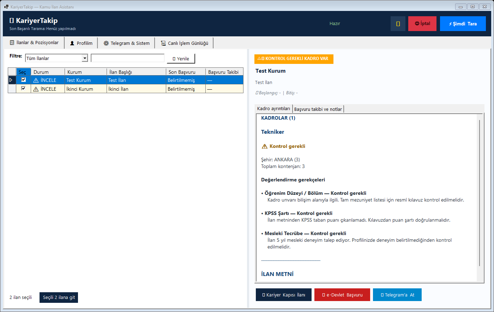
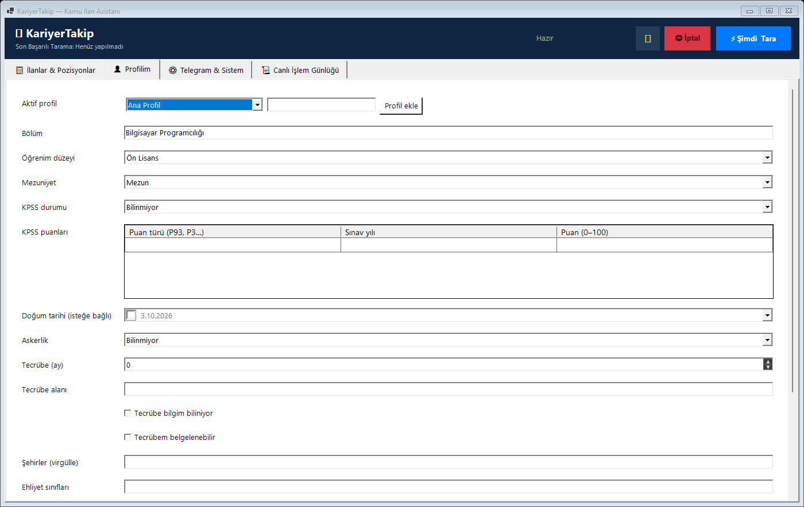
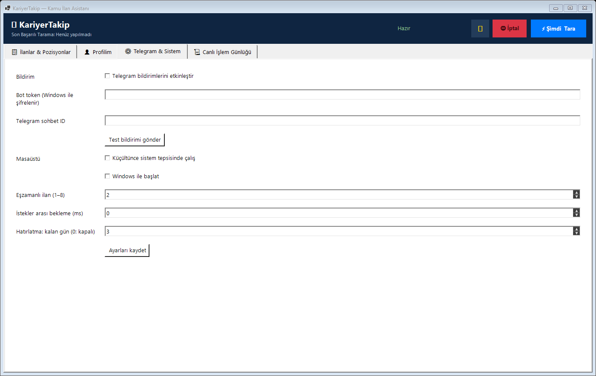

# KariyerTakip

Windows için Kariyer Kapısı ve Kamu İlan (SBB) ilanlarını ayrı bölümlerde takip eden, API ve PDF belgelerinden alınan kadro şartlarını profille karşılaştıran ve başvuruları takip eden masaüstü uygulaması. C# / .NET 10, WinForms ve SQLite kullanır.

Bu proje resmî değildir; kişisel kullanım için dokümante edilmemiş kamuya açık API'yi düşük istek hızıyla okur. İstemci kendisini `KariyerTakip/1.0` olarak tanıtır. Portal izinleri ve kullanım koşullarına uyun; erişim kısıtlarını aşmaya çalışmayın.

## Özellikler

- İlan ve kadro taraması; uygun / kontrol gerekli / uygun değil sonuçları ve ayrı gerekçe satırları.
- Kariyer Kapısı ve Kamu İlan (SBB) için ayrı sekmeler; bildirimlerde kaynak adı.
- SBB PDF tablolarından kadro, mezuniyet, KPSS, kontenjan ve özel şartları çıkarma; resmî PDF'yi yerel önbellekten açma.
- Sütun başlığıyla sıralama, başvuru durumu ve son tarih filtreleri; kurum, başlık, unvan ve şehir araması.
- Kalan süre ve kadro sayısı sütunları; sağ tıkla sütunları gösterme/gizleme.
- Kutucuklarla çoklu seçim, görünen ilanları topluca seçme ve seçili ilanları CSV'ye aktarma.
- Seçili Kariyer Kapısı ilanlarını tarayıcıda, SBB belgelerini PDF görüntüleyicisinde açma; SBB sitesine ayrı düğmeyle erişme.
- Başvuru takibi: **başvuracağım / başvurdum / geçtim** ve yerel notlar.
- Birden fazla profil ve her profilde birden fazla KPSS puan türü/yılı.
- Öğrenim, KPSS, tecrübe, yaş, askerlik, sertifika, ehliyet, şehir ve çalışma türü değerlendirmesi.
- Profil değişince önbellekteki kadroları yerel olarak yeniden değerlendirme.
- Telegram bildirim kuyruğu, parça ilerlemesini saklama ve son başvuru hatırlatmaları.
- Sistem tepsisine küçültme ve isteğe bağlı Windows ile başlatma.
- Kompakt 1080×700 pencere (en az 900×600), daha küçük boşluklar ve açık/koyu tema; dar alanda satır kaydıran araç düğmeleri.
- Ekransız tarama, UTC dosya günlükleri ve Windows x64 tek dosya yayın paketi.

## Ekran görüntüleri

Görseller sentetik test verileriyle oluşturulmuştur; kişisel ayar veya gerçek token içermez.





## Hızlı Başlangıç ve Çalıştırma

### 1. Hazır Doğrudan Çalıştırılabilir EXE (Önerilen)

Kurulum yapmaya veya .NET SDK yüklemeye gerek kalmadan programı doğrudan çalıştırmak için:

- **[Kompakt sürüm EXE'yi indir](https://github.com/cumakaya0000/kariyerTakip/releases/download/kompakt-2026-10-05/KariyerTakip-Kompakt.exe)** — açık olan KariyerTakip'i tepsi simgesinden de kapatın, ardından indirdiğiniz EXE'yi çalıştırın.
- **[Windows x64 ZIP paketini indir](https://github.com/cumakaya0000/kariyerTakip/releases/download/kompakt-2026-10-05/KariyerTakip-Kompakt-win-x64.zip)** — klasöre çıkarıp içindeki `KariyerTakip.exe` dosyasını çalıştırın.
- **[Tüm sürümler ve indirmeler](https://github.com/cumakaya0000/kariyerTakip/releases)** — sürüm notları ve dosyaların SHA256 sağlama toplamları.

**05.10.2026 kompakt sürümü:** 1080×700 varsayılan pencere, en az 900×600 boyut; daha küçük düğmeler ve boşluklar. Açık/koyu temada tarih alanı, tablo seçim renkleri, devre dışı düğmeler, uyarı etiketleri ve sütun menüsü düzeltildi. SBB PDF desteği, yeni ilan filtreleri ve CSV aktarımı bu sürüme dahildir.

> [!NOTE]
> **Windows Uygulama Denetimi (Hata 4551) Uyarısı:**
> Standart Inno Setup kurulum sihirbazları `%TEMP%` klasörüne geçici `.tmp` dosyası açıp çalıştırdığı için Windows 11 Akıllı Uygulama Denetimi (Smart App Control) tarafından engellenebilir (Hata 4551). Doğrudan çalıştırılabilir EXE kurulum sihirbazını gerektirmez; ancak EXE ve .NET'in çıkardığı dosyalar da Windows güvenlik ilkesine tabidir. Uygulama denetimi engellerse aşağıdaki sorun giderme bölümünü inceleyin.

### 2. Kurulum Sihirbazı ile Kurulum

`KariyerTakip-Kurulum.exe` KT simgeli Türkçe kurulum sihirbazıdır. Windows 10 (1809 veya sonrası) ve Windows 11 için x86, x64 veya ARM64 sürümünü otomatik seçer; .NET çalışma zamanı pakete dahildir.

Sihirbaz programı tanıtır, kurulum klasörünü seçtirir ve masaüstü kısayolu / Windows ile başlatma kutularını sunar. Varsayılan konum `%LOCALAPPDATA%\Programs\KariyerTakip` olduğu için yönetici hesabı gerekmez.

Denetim Masası > Programlar ve Özellikler veya Windows Ayarları > Uygulamalar bölümündeki **KariyerTakip** kaydıyla kaldırabilirsiniz.

### 3. Kaynak Koddan Derleme ve Çalıştırma

Windows 10/11 ve .NET 10 SDK gerekir. Proje kök dizinindeki [`Kurulum.bat`](Kurulum.bat) dosyasını çalıştırabilir veya terminalden şu komutları uygulayabilirsiniz:

```powershell
git clone https://github.com/cumakaya0000/kariyerTakip.git
cd kariyerTakip
dotnet restore KariyerTakip.slnx
dotnet build KariyerTakip.slnx -c Release --no-restore
dotnet test KariyerTakip.slnx -c Release --no-build
dotnet run --project KariyerTakip.csproj
```

Test projesi çözüme dahildir. Çözüm üzerinden test komutu gerçekten testleri çalıştırır.

## İlan listesi ve filtreler

İlan listesinde sütun başlıklarına tıklayarak sıralama yapabilirsiniz; son başvuru tarihleri takvim sırasıyla sıralanır. **Kalan Süre** ve **Kadro** sütunları özet bilgiyi gösterir. Sütun başlığına sağ tıklayarak sütunları gizleyebilir/gösterebilirsiniz. Başvuru durumu ve son tarih filtreleri uygunluk filtresiyle birlikte çalışır; arama kurum, başlık, unvan ve şehirleri kapsar. **Görünenleri seç**, **Seçimleri temizle** ve **Seçilileri CSV'ye aktar** düğmeleri toplu işlemler içindir. CSV kişisel notları içermez; SBB için herkese açık site adresini kullanır.

- **Son tarih:** aktif ilanlar, 7 veya 30 gün içinde bitenler ve süresi dolanlar. Tarihi bilinmeyen ilanlar tarih sıralamasında en sonda gösterilir.
- **Kalan Süre:** bir günden az kaldığında saat, diğer durumlarda gün; son üç gündeki tarihler turuncu gösterilir.
- **Kadro:** ilandan okunabilen kadro satırı sayısıdır; toplam kontenjan değildir.
- **Seçim:** filtreleme ve sıralama işaretli ilanları korur. CSV aktarımı aynı kaynaktaki filtre dışında kalmış seçili ilanları da içerir. **Seçimleri temizle** tüm işaretleri kaldırır.
- **CSV:** UTF-8, noktalı virgülle ayrılmış dosya; kaynak, kurum, başlık, uygunluk, son başvuru, başvuru takibi, kadro sayısı ve resmî bağlantı sütunlarını içerir.

## İlan kaynakları ve SBB PDF belgeleri

**Kariyer Kapısı** ve **Kamu İlan (SBB)** ayrı ilan sekmeleridir. **Şimdi Tara** ve ekran olmadan tarama iki kaynağı da okur; bir kaynak erişilemezse diğerinin taraması sürer ve sonuç kısmi olarak bildirilir. Mevcut Kariyer Kapısı kayıtları, başvuru durumları ve notları korunur. Telegram mesajlarında kaynak adı bulunur.

[Kamu İlan (SBB)](https://kamuilan.sbb.gov.tr/) için herkese açık ilan listesi ve resmî PDF belgeleri okunur. PDF istekleri aynı oturum ve ana sayfa referansıyla yapılır. PDF tablolarındaki unvan, ilan kodu, kontenjan, mezuniyet, KPSS ve özel şartlar kadro bazında ayrılır; genel şartlar ayrı saklanır. Her kadro aktif profilinizle değerlendirilir ve gerekçelerde PDF'deki ilgili şart gösterilir. PDF metni önbellekte saklandığından profil değişince belge yeniden indirilmeden değerlendirilir.

Sitede yıl belirtilmeyen tarihler güncel tarihe göre yorumlanır; PDF'de açıkça belirtilen başlangıç/bitiş tarihi ve saati liste tarihinden önceliklidir. PDF okunamazsa mevcut metin, kadrolar ve PDF'den alınmış tarihler korunur; sonuç **Kontrol gerekli** gösterilir. Taranmış görüntü PDF'leri, güvenilir biçimde ayrılamayan kadrolar ve profil kapsamı dışındaki akademik şartlar otomatik kesin sonuca dönüştürülmez. Görüntü PDF'leri için bu sürümde OCR yoktur. PDF başına 20 MB / 100 sayfa sınırı vardır. Resmî belgeyi kontrol edin; kontrol gereken ilanların bildirimleri için **kontrol gerekli ilanları dahil et** ayarı açık olmalıdır.

SBB'nin şifreli `kod` bağlantıları her sayfa okumasında değiştiğinden kimlik olarak kullanılmaz. Kurum, başlık ve yayın günü ile yerel kimlik üretilir; bağlantı her başarılı taramada yenilenir. Aynı kurumun aynı başlık ve yayın gününe sahip tekrarları tek kayıt olarak tutulur.

SBB bağlantıları tarayıcıya doğrudan taşındığında oturum/referans gereksinimi nedeniyle 404 dönebilir. **Kamu İlan PDF** düğmesi, ilanı çift tıklama ve toplu açma işlemi indirilen resmî PDF'yi varsayılan PDF görüntüleyicisinde açar. Belgeler veri klasörünün `documents` dizininde saklanır ve sonraki başarılı indirmelerde yenilenir. PDF henüz indirilmemişse uygulama güncel listeden yeni bağlantıyı bulur ve aynı oturumla indirir. Telegram mesajları oturuma bağlı belge bağlantısı yerine SBB listesi/arşivi bağlantısını içerir.

Kamu İlan sekmesindeki site düğmesi [kamuilan.sbb.gov.tr](https://kamuilan.sbb.gov.tr/) ana sayfasını varsayılan tarayıcıda açar.

## Profil ve başvuru takibi

**Profilim** sekmesinde mevcut profili seçin veya yeni profil ekleyin. KPSS tablosunun boş satırına P93/P3/P94, sınav yılı ve puanı girerek birden fazla puan saklayabilirsiniz. Satır seçip Delete ile silebilirsiniz. Aynı puan türü/yıl çifti yinelenemez. **Kaydet** düğmesi aktif profili ve diğer profilleri saklar, ilanları yeniden değerlendirir.

Doğum tarihi kutusunu işaretlemezseniz doğum tarihiniz bilinmiyor kabul edilir. Yaş şartı bulunan kadrolar kontrol gerektirebilir. `Experience.TotalMonths` ay cinsindedir; bilinmiyor/belgeli seçenekleri ayrı saklanır. Çalışma türlerini boş bırakırsanız tür filtresi uygulanmaz. Sertifika adlarını virgülle ayırın. Belirsiz veya metinden çıkarılamayan koşullar kontrol gerektirir; sonuçlar resmî başvuru kararının yerine geçmez.

İlan ayrıntılarındaki **Başvuru takibi ve notlar** sekmesinden başvuru durumunu ve kişisel notları kaydedin. Sonraki tarama bu kayıtları silmez. Başvurulmuş veya geçilmiş ilanlara son tarih hatırlatması gönderilmez.

## Ayarlar ve veri klasörü

Git deposunda yalnızca `appsettings.example.json` ve `profile.example.json` bulunur. İlk çalıştırmada gerçek dosyalar veri klasörüne oluşturulur. Yerel `appsettings.json`, `profile.json`, `profiles.json`, `telegram.secret`, SQLite ve günlük dosyaları Git'e dahil edilmez.

Varsayılan veri klasörü `%LOCALAPPDATA%\KariyerTakip` dizinidir. Exe yanında `portable.flag` veya eski bir `appsettings.json` / `profile.json` bulunursa o klasör kullanılır. `KARIYERTAKIP_DATA_DIR` ortam değişkeniyle başka bir tam yol seçebilirsiniz. Veri klasörünün yazılabilir olması gerekir.

- `appsettings.json`: uygulama ayarları ve Logging bölümü. Ayar kaydı diğer üst düzey JSON bölümlerini korur.
- `profile.json`: aktif profilin uyumluluk kopyası.
- `profiles.json`: adlandırılmış profiller ve aktif profil; mevcutsa esas kaynak budur.
- `telegram.secret`: Windows DPAPI ile mevcut Windows hesabına bağlı şifreli token.
- `kariyertakip.db`: ilanlar, kadrolar, değerlendirmeler, başvuru notları ve kuyruk.
- `documents/`: indirilen resmî SBB PDF belgeleri; Git deposuna veya yayın paketine eklenmez.
- `logs/kariyertakip-YYYY-MM-DD.log`: UTC zaman damgalı günlükler.

Eski profillerde `Experience.Years` aya çevrilir; `OtherConditions.MilitaryStatus` üst seviyeye taşınır. `MaxAge` bir kişinin doğum tarihi yerine kullanılamayacağı için doğum tarihi uydurulmaz. Eski SQLite şeması kayıtlar korunarak otomatik güncellenir; veritabanını silmeyin.

Bozuk ayar/profil JSON'u `.bak` dosyasına taşınır ve varsayılanla devam edilir. Var olan yedekler üzerine yazılmaz. Açılış uyarıları arayüzde gösterilir ve günlükte saklanır; ekran olmadan çalışırken MessageBox açılmaz. Yinelenen profil adlarında büyük/küçük harf farkı dikkate alınmaz; ilk profil korunur. DPAPI tokenı okunamazsa tarama devam eder, Telegram tokenı boş kalır ve yeniden girmeniz istenir.

`Kaldir.bat`, onayınızdan sonra uygulama klasöründeki eski/portable veriyi, `%LOCALAPPDATA%\KariyerTakip` verisini ve varsa `KARIYERTAKIP_DATA_DIR` içindeki uygulama dosyalarını temizler. JSON, token, varsayılan veritabanı/WAL dosyaları, günlükler, geri bildirimler, derleme çıktıları ve mevcut kullanıcının Windows başlangıç kaydı silinir. `DatabasePath` ile farklı ad/yol seçtiyseniz o özel veritabanını ayrıca kontrol edin. Önce uygulamayı kapatın; çalışan örnek varsa temizleme başlamaz. Betik hatada başarı mesajı vermez. Başka Windows hesaplarının dosyalarını/kayıtlarını temizlemez. İşlem geri alınamaz; ihtiyaç duyduğunuz veriyi önceden yedekleyin. PowerShell betik çalıştırma ilkesi izin vermiyorsa işlem hata ile durur; korumayı otomatik değiştirmez. İzinli ortamda silinecek hedefleri görmek için `./scripts/Uninstall.ps1 -ApplicationDirectory . -WhatIf` kullanın.

## Telegram

BotFather ile bot oluşturup token ve sohbet ID'sini **Telegram & Sistem** sekmesine girin. Token maskelenir ve kaydedildiğinde DPAPI ile korunur. Eski düz metin token ilk açılışta şifreli dosyaya taşınır; JSON'dan çıkarılır. Şifreli dosya başka Windows hesabında açılamaz; o hesapta token'ı tekrar girin.

Ortam değişkenleri de kullanılabilir; bunlar yerel ayarlardan önceliklidir:

```powershell
$env:KARIYERTAKIP_KariyerTakip__Telegram__BotToken = 'BOT_TOKEN'
$env:KARIYERTAKIP_KariyerTakip__Telegram__ChatId = 'CHAT_ID'
$env:KARIYERTAKIP_KariyerTakip__Telegram__Enabled = 'true'
```

**Test bildirimi** uygulamanın DI istemcisini kullanır. Token içeren HTTP istemci günlükleri kapatılır; uygulama hata mesajları token/URL içermez.

[Telegram Bot API](https://core.telegram.org/bots/api#sendmessage) sınırlarına göre mesajlar bölünür. Uzun mesajlarda düz metne geçilerek HTML etiketleri/karakter kaçışları bozulmadan bölünür; bağlantı adresleri korunur. Başarılı her parça veritabanına işlenir; sonraki deneme kalan parçadan başlar. `429` yanıtındaki [retry_after](https://core.telegram.org/bots/api#responseparameters) tüm kuyruğun bekleme süresine uygulanır. Kalıcı hatalar otomatik tekrar edilmez.

Ağ kesintisinde Telegram isteği kabul etmiş ancak uygulama yanıtı alamamış olabilir. API idempotency anahtarı sunmadığından bu belirsiz durumda tam olarak bir kez teslim garantisi verilemez.

## Tarama, zaman ve hatırlatmalar

İlan/kadro tarihleri ve veritabanındaki zaman damgaları UTC tutulur; arayüz ve Telegram Türkiye saatini gösterir. Saat dilimi taşımayan portal tarihleri Türkiye saati kabul edilir. Doğum tarihi takvim tarihidir.

`Scan.MaxConcurrency` 1–8 arasında eşzamanlı ilan sayısını, `RequestDelayMs` tüm API istekleri arasındaki asgari aralığı belirler. Varsayılanlar 2 ve 300 ms. 429/5xx ve ağ hatalarında üstel bekleme, jitter ve HTTP `Retry-After` kullanılır. İptal istekleri yeniden denenmez.

API `Retry-After` değeri 60 saniyeyi aşarsa tarama içinde beklenmez; istek hata olarak sonraki taramaya bırakılır. Telegram kuyruğu sunucunun istediği süreyi zaman damgasıyla saklar; uzun süre boyunca açık bir görev bekletilmez.

`Scan.ApiWarningThreshold` (varsayılan 3), üst üste boş liste veya ayrıştırma hatası sonrasında “API değişmiş olabilir” uyarısını Telegram kuyruğuna ekler. Sayaç `api-health.json` içinde süreçler arasında saklanır; aynı kesinti için tek uyarı oluşturulur. Telegram kapalıysa gönderilemez. Boş listenin arama filtresinden veya gerçekten ilan olmamasından kaynaklanabileceğini de kontrol edin. Gerçek API örnekleri `tests/KariyerTakip.Tests/Fixtures/Api/2026-10-03` altında sözleşme testlerinde kullanılır.

İlan ayrıntısındaki **Bu değerlendirme yanlış** düğmesiyle beklenen sonucu ve açıklamanızı kaydedebilirsiniz. Kamuya açık ilan/kadro metni veri klasöründeki `feedback-fixtures` içine JSON olarak kaydedilir. Profil, token veya başvuru notları aktarılmaz. Serbest açıklamaya kişisel bilgi yazmayın. Bu dosyalar otomatik yayımlanmaz veya teste dönüştürülmez; inceleyip uygun bir regresyon testi eklemek gerekir.

Kadro anahtarları başlık/unvan kimliğinden üretilir; API sıralaması kimliği değiştirmez. Eski eşleşen kadro anahtarları korunur. Aynı kimlikli kadrolar ayrıştırılır; artık dönmeyen kadrolar geçmişten silinmeden pasif yapılır. API başarısız olduğunda önbellek korunur.

`Scan.ReminderDays` son başvuruya kaç gün kala hatırlatma gönderileceğini belirler (varsayılan 3; 0 kapalı). Hatırlatmalar **tarama çalıştığında** kontrol edilir ve ilan/son tarih/eşik için tekilleştirilir. Düzenli kontrol için Görev Zamanlayıcı kullanın; uygulamanın açık olması tek başına periyodik tarama başlatmaz.

```powershell
# Kaynak koddan
dotnet run --project KariyerTakip.csproj -- --scan-once
# Yayın paketinden
.\KariyerTakip.exe --scan-once
```

| Çıkış kodu | Sonuç |
|---|---|
| 0 | Başarılı |
| 1 | Başarısız |
| 2 | Kısmi; bazı ilanlar okunamadı |
| 3 | İptal edildi |
| 4 | Başka bir tarama çalışıyor |

Tarama işi asenkron yürür; WinForms giriş noktası STA gereksinimi için senkron tutulur. `scripts/ZamanlanmisTarama.bat` yayın paketinde exe ile aynı klasöre konur. Görev Zamanlayıcı'da saatlik tetikleyici ve aynı Windows hesabıyla bu betiği çalıştırın. Bir önceki görev sürüyorsa yeni örnek başlatmama seçeneğini seçin.

Arayüz ve ekran olmadan çalışan görev aynı `Global\KariyerTakip` mutex'ini süreç boyunca tutar. Arayüz açıksa zamanlanmış görev kod 4 ile çıkar; tarama için arayüzü kapatın veya **Şimdi Tara** düğmesini kullanın. SQLite WAL modunda çalışır ve her bağlantıda 5 saniye `busy_timeout` vardır. Beklenmedik sonlanan süreçten kalan mutex sonraki çalışmada devralınır.

## CI ve yayın

Kurulum exe'sini yeniden oluşturmak için Inno Setup 7 gerekir: `./scripts/BuildInstaller.ps1 -CompilerPath 'ISCC.exe tam yolu'`. Betik üç mimariyi yayınlar, `installer/KariyerTakip.iss` dosyasını derler ve exe'nin yanına SHA256 dosyası yazar. `PrepareInstallerCompiler.ps1`, resmi ve yayıncı imzası doğrulanan Inno Setup 7.1.0 derleyicisini çalışma alanına portable olarak hazırlar; sisteme kaldırma kaydı eklemez. Yayın iş akışı ZIP ile birlikte kurulum exe'sini de üretir.

- `.github/workflows/ci.yml`: `main` push ve PR'larda `windows-latest` ile Release derlemesi ve çözüm testleri; TRX raporu artifact olarak saklanır.
- `.github/workflows/release.yml`: elle çalıştırıldığında test edilmiş Windows zip artifact'i oluşturur. `v*` etiketi gönderildiğinde aynı paket GitHub Releases'e yüklenir.
- Yerel paket: normal PowerShell oturumunda `& ./scripts/Publish.ps1` çalıştırın. Betik çalıştırma ilkeniz izin vermiyorsa CI iş akışını kullanın.
- Paket exe, örnek ayarlar, belgeler, ekran görüntüleri, sağlama toplamı, Görev Zamanlayıcı ve kaldırma betiklerini içerir; kişisel veri içermez.

SDK `global.json` ile 10.0.401 sürümüne sabitlenir; aynı özellik bandındaki düzeltme sürümleri kabul edilir. CI ve yayın akışı doğrudan/geçişli NuGet güvenlik denetimini çalıştırır. Dependabot NuGet ve GitHub Actions için haftalık güncelleme önerir; güvenlik bildirimleri [SECURITY.md](SECURITY.md) içindedir.

Tek dosya yayınında sıkıştırma açıktır. ZIP içinde exe için `SHA256SUMS.txt`, ZIP yanında `KariyerTakip-win-x64.zip.sha256` bulunur. PowerShell'de `Get-FileHash .\KariyerTakip-win-x64.zip -Algorithm SHA256` çıktısını yan dosyayla karşılaştırın. SHA256 kimlik doğrulayan bir kod imzası değildir. Bir Windows kod imzalama sertifikanız varsa yayın ortamında `KARIYERTAKIP_SIGN_THUMBPRINT` ayarlayıp `signtool.exe`yi PATH'e ekleyin; aksi durumda paket imzasızdır. Sürüm notları `CHANGELOG.md` içeriğinden oluşturulur.

## Sık karşılaşılan sorunlar

| Sorun | Çözüm |
|---|---|
| SQLite `ON CONFLICT` hatası | Güncel sürümü açın; benzersiz indeks otomatik eklenir. Veritabanını silmeyin. |
| Exe kopyalanamıyor / derleme kilidi | Açık KariyerTakip'i ve tepsi simgesinden çalışan örneği kapatın, yeniden derleyin. |
| Windows Uygulama Denetimi exe/test DLL'sini engelliyor | Windows güvenlik/kurum ilkesini kontrol edin. Korumayı kapatmayın; politika yöneticisi veya güvenilir bir yayın paketiyle ilerleyin. |
| Telegram 401/403 | Token, sohbet ID, botla `/start` ve sohbet izinlerini kontrol edin. |
| Telegram 429 | Kuyruk belirtilen süreyi bekler; daha sonraki taramada devam eder. |
| API/JSON yanıtı değişti | Dosya günlüğünü kontrol edip örnek yanıtla sorun açın. |
| SBB PDF bağlantısı tarayıcıda 404 veriyor | Uygulamadaki **Kamu İlan PDF** düğmesini kullanın; belge aynı oturumla indirilip yerel olarak açılır. |
| SBB belgesi okunamıyor / kadrolar ayrıştırılamıyor | Resmî PDF'yi açıp kontrol edin. Görüntü PDF'leri için OCR yoktur; belirsiz şartlar **Kontrol gerekli** kalır. |
| İlanlar kontrol gerekli görünüyor | Aktif profili kaydedip yeniden değerlendirin; bilinmeyen şartlar için kılavuzu kontrol edin. |
| Şifreli token başka hesapta okunamıyor | Token'ı o Windows hesabında yeniden kaydedin. |

## Geliştirme ve katkı

Servisler `Services/`, depolama `Storage/`, modeller `Models/`, UI bileşenleri `Forms/` altındadır. Profil/ayar/bildirim kaydı servislerde; sekmeler ayrı UserControl bileşenlerindedir. `MainForm` seçim, tarama, tema ve bileşen koordinasyonunu yapar.

Tarama yaşam döngüsü ve iptali `ScanPresenter`, tepsi/menü yaşam döngüsü `DesktopLifetime` içinde yönetilir. Tema ve günlük görünümü ayrı partial dosyalardadır. `DeadlineReminderService` DI'dan alınır.

Testler ayrıştırma, uygunluk, şema migrasyonu, sıra bağımsız kadro kimliği, iptal, sahte HTTP yanıtları, mesaj bölme/kodlama, kısmi gönderim, hız sınırı, yollar, ayar koruma, DPAPI, loglar, profiller, başvuru takibi ve hatırlatmaları kapsar. DPAPI testlerini normal Windows kullanıcı hesabında çalıştırın. Gerçek kurumsal ilanlardan kısa örneklerin kaynakları test dosyasında belirtilmiştir.

Katkı için bir dal açın, ilgili regresyon testini ekleyin ve `dotnet test KariyerTakip.slnx` çalıştırın. PR'a davranış değişikliğini ve doğrulamayı yazın. Bot token, kişisel profil, kimlik bilgisi veya veritabanı eklemeyin. Sürüm değişiklikleri [CHANGELOG.md](CHANGELOG.md) dosyasındadır.

Kariyer Kapısı'nın kamuya açık portal uç noktaları kullanılır; bu proje için yayımlanmış/sözleşmeli bir API garantisi yoktur. Portal değişirse entegrasyon güncellenmelidir. Uygulama e-Devlet şifresi veya T.C. kimlik numarası istemez; başvuru resmî sitede yapılır.
